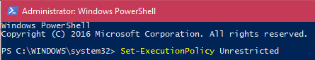

# WindowsWifiHotspot

A crappy small batch and PowerShell script to provide a semi-sane interface to setting up a secure Wifi hotspot in Windows for
other devices to connect to for an internet connection. This requires no extra software, just two tiny script files.

Download the ZIP file containing the two files from the [releases page](https://github.com/EspeonOfEspeonage/Windows-Wifi-Hotspot/releases).

If it is your first time setting this up, please follow the second section "First Time Setup" first.

## Using the script

- Ensure that `run.bat` and `wifihotspothelper.ps1` are both in a folder somewhere together.
- Simply run `run.bat` and allow it to run as Administrator when you are prompted.

- You will be asked for an SSID (the name of the hotspot) and a PSK (the password for the hotspot). The PSK must be
  at least 8 letters long.
  

- And that is it! Everything should now be ready!

- The hotspot will be destroyed once you shut down your computer. You will not need to run the stuff in the first time setup again
however (hopefully).

## First time setup

Place the batch file and the PowerShell script in a folder somewhere.

1. Go to your Start Menu

2. Type in `Powershell` and right click the result that appears, and click "Run As Administrator".

3. Run `Set-ExecutionPolicy Unrestricted`.

4. A long warning message will show up. Just press `A` and then `Enter` on your keyboard.

5. You can now close that Window. 

6. Run the script as explained in "Using the script". Once it says you are ready to connect, return to here and
   complete this section before continuing.
   
7. Go to Start, and type in `ncpa.cpl` and hit `Enter` on your keyboard.

8. The network adapters for your computer will appear. Right click your adapter you use for the internet and 
   select `Properties` (it will be most likely "Ethernet" or "Local Area Connection" if you use a wired connection, or "WiFi" if you use
   Wireless. **IT IS NOT THE ONE THAT SAYS `MICROSOFT HOSTED NETWORK VIRTUAL ADAPTER`... this is the virtual adapter
   we just made from our script!**
   

9. Go to the `Sharing` tab, and tick the checkbox next to `Allow other network users to connect through this computer's Internet
   connection`. Pick the adapter that is the `Microsoft Hosted Network Virtual Adapter` in the previous Window (see the circled
   screenshot icon above). Then click `OK` and close the Windows. 
   
10. You are now good to go. Connect your devices to your heart's content.
